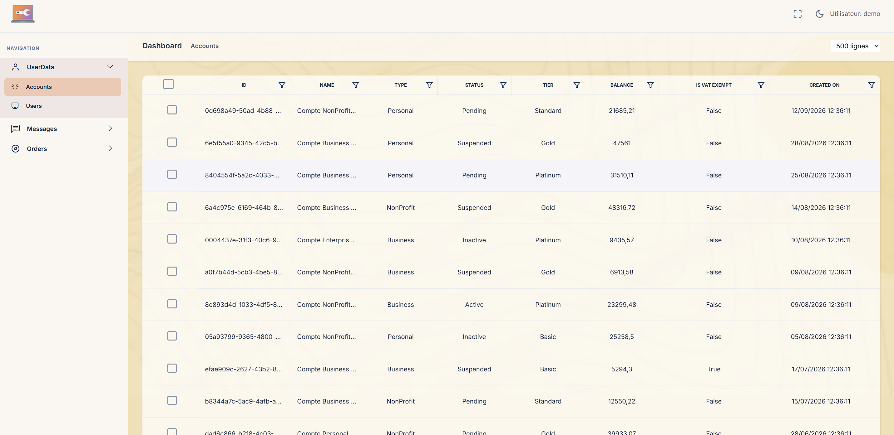
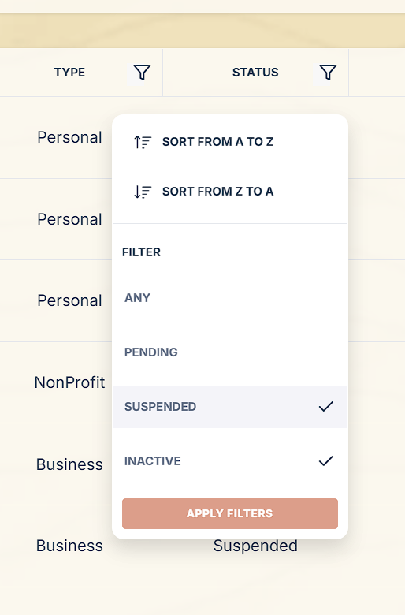

# Introduction 
Model.BO is a web application framework to visualize and apply modifications to a database. Made at the start for a company with custom features, it has been built to be integrated as an internal solution for business purposes.
I had the opportunity to adapt it and create a model that can be used in a variety of projects involving a db. 



## Features 

### Access Rights using Windows Authentication

Login is made through Windows Authentication, and therefore doesn't need accounts creation. It can be configured easily with groups already existing in the directory. Each group can be configured to have specific access and edit rights for each page (reader, editor, admin), using the CRUDrights.json file:

```json
{
  "groups": {
    "adminGroup": {
      "Accounts": "admin",
      "Users": "admin",
      "Messages": "admin",
      "Orders": "admin",
      "Products": "admin",
      "Prices": "admin"
    },
    "editorGroup": {
      "Accounts": "editor",
      "Users": "editor",
      "Messages": "editor",
      ...
```
Authorization checks can be easily implemented in Razor views to prevent certain elements from rendering before being sent to the client:
```csharp
<h1> Title </h1>
if ((await AuthorizationService.AuthorizeAsync(User, "RequireAdminAccounts")).Succeeded)
{
    <button> Delete all rows </button>
}
<span> Hi </span>
...
```

### Advanced Filtering

Tables can be ordered and filtered effortlessly, with differents filters depending on the data type. Custom options can also be added in the data.json file: 



### Easily Configurable

Tables can be configured in the pagesLayout.json file to display and modify columns. Header and row actions are also customizable:

```json
  "Messages": {
    "Colonnes Tables": {
      "Number of retries": {
        "DBColumn": "RetryCount",
        "Type": "Number"
      },
      "ErrorMessage": {
        "DBColumn": "ErrorMessage"
      }
      "ProcessedOn": {
        "DBColumn": "ProcessedOn",
        "Type": "DateTime"
      },
      "CorrelationId": {
        "DBColumn": "CorrelationId"
      }
    },
    "Colonne Actions": {
      "Buttons": {
        "User details": {
          "StatusRequired": "ReaderUsers",
          "Icon": "bi-eye",
          "Link": {
            "Href": "~/UserData/UserDetail",
            "Parameters": {
              "Id": "Id"
            }
          }
        }
      }
    },
    "VisibleColumnsOnMobile": [ "ErrorMessage", "Priority", "PayloadSize" ],
    "EditableColumns": [ "ProcessedOn", "CorrelationId", "Priority" ],
    "DeletableRows": true,
    "Default message": "No message found."
  },
```


# Getting Started

## Run the demo
1. Clone the repo
```bash
git clone https://github.com/BaptoastGit/db-visualizer-model.git
```
2. Open Visual Studio
3. Press the Play button or run this command in your terminal:
```bash
dotnet run
```

(The SQLite database will be automatically created and seeded with demo data on the first launch).

## Enable Authentication

1. Disable Authentication bypass in the appsettings.Development.json : 
```json
  "BypassAccessRights": false
```
2. Add custom users or groups to the CRUDrights.json file:
```json
"<MACHINE_NAME>\\<USERNAME>": {
  "Accounts": "admin",
  "Users": "admin",
  "Messages": "admin",
  "Orders": "admin",
  "Products": "admin",
  "Prices": "admin"
}
```
Your username can be found at the top-right corner of any page.

## Link your db

### To switch from SQLite to SQL Server:

1. Add your connection string to the appsettings.Development.json file:

```json
  "ConnectionStrings": {
    "TestConnectionString": "Server=localhost,1433;Database=DemoDb;User Id=sa;Password=DemoPassword123!;TrustServerCertificate=True;"
  }
```
2. Remove the demo sqlLite db and Uncomment the SqlServer service in the Program.cs file:
```csharp
builder.Services.AddDbContext<ModelDbContext>(options =>
    options.UseSqlite("Data Source=demo.db"));

//builder.Services.AddDbContext<ModelDbContext>((serviceProvider, options) =>
//{
//    options.UseSqlServer(builder.Configuration.GetConnectionString("TestConnectionString"));
//});
```
3. Remove the data generated for the demo in the Program.cs file:
```csharp
using (var scope = app.Services.CreateScope())
{
    var context = scope.ServiceProvider.GetRequiredService<ModelDbContext>();
    // DemoDb.GenerateFakeDb(context);
}
```
4. Fill the [Entity Framework Core](https://learn.microsoft.com/en-us/ef/core/managing-schemas/scaffolding/?tabs=dotnet-core-cli) DbContext with this command:
```terminal
dotnet ef dbcontext scaffold "Data Source=(localdb)\MSSQLLocalDB;Initial Catalog=Chinook" Microsoft.EntityFrameworkCore.SqlServer
```
You should see the replication of your db in the Model.BO.Data/Model Folder.

## Display the tables

1. Fill the pagesLayout.json file with the tables you want to show:
```json
  "Messages": { -> Page name
    "Table": "Messages", -> Table Related
    "NavigationGroup": "Messages",
    "TabIcon": "bi-chat-left-dots",
    "Colonnes Tables": { -> Columns Shown
      "Number of retries": { -> Column Customization
        "DBColumn": "RetryCount",
        "Type": "Number"
      },
      "ProcessedOn": {
        "DBColumn": "ProcessedOn",
        "Type": "DateTime"
      },
      "CorrelationId": {
        "DBColumn": "CorrelationId"
      }
    },
    "VisibleColumnsOnMobile": [ "ErrorMessage", "Priority", "PayloadSize" ],
    "EditableColumns": [ "ProcessedOn", "CorrelationId", "Priority" ],
    "DeletableRows": true,
    "Default message": "No message found."
  },
  "Prices": {
  "Table": "Prices",
  "NavigationGroup": "Orders",
  "TabIcon": "feather-credit-card",
  "Colonnes Tables": {
    "Currency": {
      "DBColumn": "Currency",
      "Type": "Fixed Values",  -> Custom List of Filter Options (data.json)
      "ValuesList": "Currency",
      "SelectAllOptionsLabel": "Any"
    },
    ...
  },
  "VisibleColumnsOnMobile": [ "Sku", "Amount", "ValidTo" ],
  "Default message": "No order found."
  }
```

2. If you make navigation groups, you can customize the incon in the data.json file.

### Create custom actions

You can add additional pages or actions related to specific rows:

#### Action with a specific row (detailPage, customPage) 

```json
    "Colonne Actions": { -> Action Row
      "Buttons": {
        "User details": { 
          "StatusRequired": "ReaderUsers", -> Status Required to show the button
          "Icon": "bi-eye",
          "Link": {
            "Href": "~/UserData/UserDetail",
            "Parameters": {
              "Id": "Id" 
            }
          }
        }
      }
    },
``` 
#### Action to a group of rows (Send back a message, save a file)
```json
"Header Actions": {
  "Send verification link": {
    "Icon": "bi-upload",
    "Function": "SendSelectedFileNames('VerificationLink')"
  },
  "Add account to log": {
    "Icon": "bi-arrow-repeat",
    "Function": "SendSelectedFileNames('Log')"
  }
}
```
___ 


